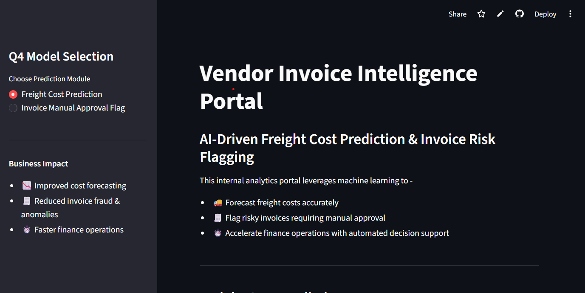
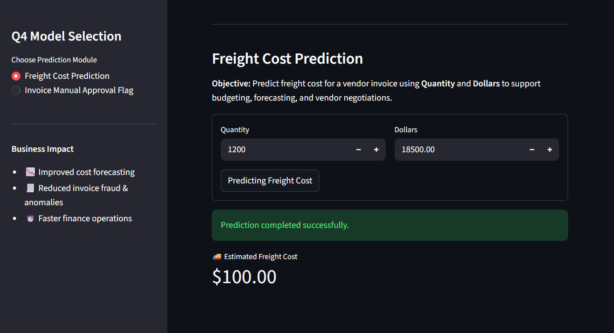
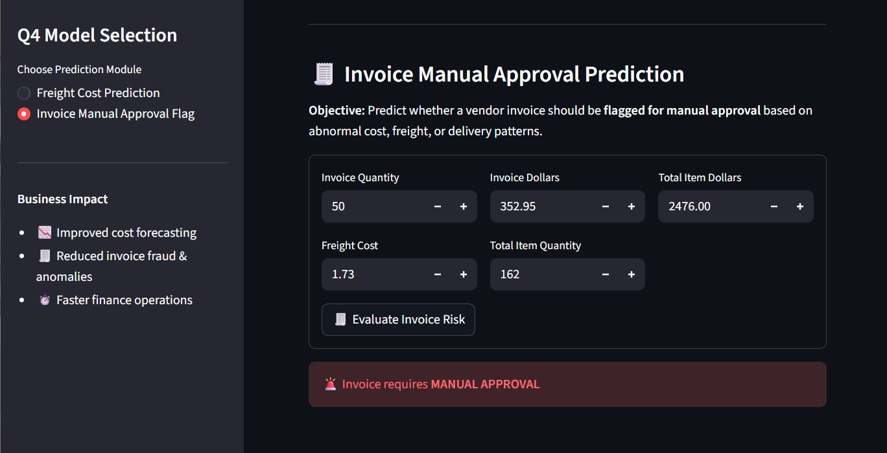

# 📦 Vendor Invoice Intelligence Portal

### AI‑Driven Freight Cost Prediction & Invoice Risk Flagging

This internal analytics portal leverages **machine learning** to:
- 🚚 Forecast freight costs accurately  
- 🧾 Flag risky invoices requiring manual approval  
- ⏱️ Accelerate finance operations with automated decision support  

---

## 📸 Screenshots

### Dashboard Overview


### Freight Cost Prediction


### Invoice Approval Workflow


## ✨ Features

- **Freight Cost Prediction**  
  Predicts estimated freight cost using invoice quantity and dollar value.  
  Output: Interactive metric card with predicted freight cost.

- **Invoice Risk Flagging**  
  Evaluates invoices for anomalies in cost, freight, or delivery patterns.  
  Output: Clear decision message:  
  - 🚨 Requires **Manual Approval**  
  - ✅ Safe for **Auto‑Approval**

- **Streamlit UI**  
  - Sidebar for module selection  
  - Form‑based inputs with validation  
  - Real‑time predictions and results display
  - 
## 📂 Project Structure

```
invoice_intelligence_system/
│
├── app.py                        # Streamlit app entry point
├── inference/
│   ├── predict_freight_cost.py   # Freight cost model inference
│   ├── predict_invoice_flag.py   # Invoice flagging model inference
│
├── models/                       # Trained ML models (joblib files)
├── requirements.txt              # Dependencies
└── README.md                     # Project documentation
```

---

## 🚀 Getting Started

### 1. Clone the repository
```bash
git clone https://github.com/Sonallgavali/Invoice_intelligence_system.git
cd invoice_intelligence_system
```

### 2. Install dependencies
```bash
pip install -r requirements.txt
```

### 3. Run the app
```bash
streamlit run app.py
```

---

## 📊 Example Outputs

- **Freight Cost Prediction:**  
  ```
  🚚 Estimated Freight Cost: $173.25
  ```

- **Invoice Risk Flagging:**  
  ```
  🚨 Invoice requires MANUAL APPROVAL
  ```
  or  
  ```
  ✅ Invoice is SAFE for Auto‑Approval
  ```

---

## 💡 Business Impact

- 📉 Improved cost forecasting accuracy  
- 🧾 Reduced invoice fraud & anomalies  
- ⏱️ Faster finance operations with automated approvals  

---

## 🔮 Future Enhancements

- Add **visual diagnostic charts** (e.g., predicted vs. actual freight costs)  
- Integrate **historical invoice datasets** for benchmarking  
- Deploy models with **ONNX/MLflow** for portability  
- Role‑based access for finance teams  
```
